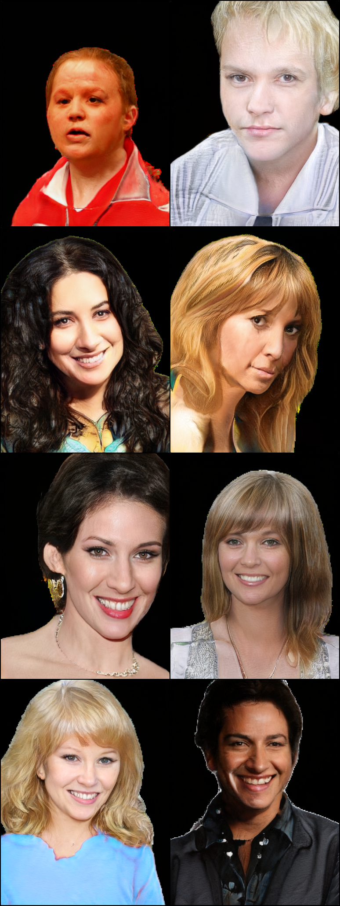

# StyleGan2_pytorch
A custom explained syleGan2 implementation on pytorch

I have added the handling of custom size that was not handle in the version i used for example

Collab notebook : https://colab.research.google.com/drive/13RD1SXeEIcbRyvqNMzUwwM8_jahLtXvC?usp=sharing

Some result after 180000 iterations with the collab above (a painful training :disappointed_relieved:)

Result are not realy good because I used a dataset with various head feature and clothes to see how well it could handle it. And I wasn't excpecting so good result. I think that with 2 or 3 times the training time I have done (2 more month with my actual specs) it could be realy good result. For comparison, the stylegan2 repo showcase result with more than 600 000 iterations (https://github.com/NVlabs/stylegan2).
